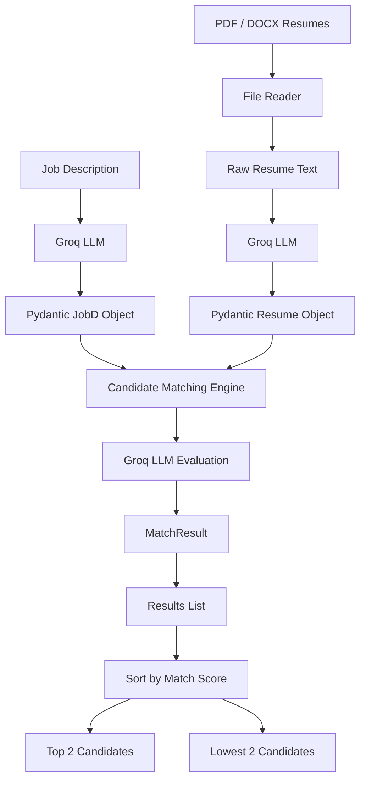

# 🤖 AI Resume Parser & Matcher

An intelligent **AI-powered recruitment pipeline** that automatically parses job descriptions and candidate resumes, converts them into structured data using **Pydantic**, evaluates candidate–job compatibility using a **Groq LLM**, and ranks candidates based on their overall match score.

The system supports both **PDF and DOCX resumes** and provides structured evaluation details such as matching skills, missing skills, interview recommendations, and final hiring verdicts.

---

## ✨ Key Features

* 📄 **Multi-format Resume Parsing** — Supports `.pdf` and `.docx` resumes.
* 🧠 **LLM-powered Information Extraction** — Extracts structured candidate and job information using Groq LLM.
* 🧩 **Structured Outputs with Pydantic** — Validates and constrains LLM-generated data using strongly typed schemas.
* 🎯 **Resume–Job Matching** — Evaluates how well each candidate matches a specific job description.
* 📊 **Candidate Scoring** — Generates a numerical match score for every candidate.
* 🔍 **Skill Gap Detection** — Identifies missing or insufficiently matched skills.
* 💡 **Interview Recommendations** — Generates candidate-specific interview suggestions.
* 🏆 **Candidate Ranking** — Automatically ranks candidates from highest to lowest match score.
* 📈 **Top & Lowest Candidates** — Displays the top 2 and lowest 2 candidates.
* 🔐 **Environment-based API Configuration** — Keeps API credentials outside the source code.

---

## 🏗️ System Architecture



---

## 🔄 How It Works

### 1. Job Description Processing

The system starts with a raw job description containing information such as:

* Job title
* Responsibilities
* Required technical skills
* Preferred skills
* Minimum experience
* Other role-specific requirements

The job description is sent to the Groq LLM and converted into a structured `JobD` Pydantic object.

---

### 2. Structured Job Representation

Pydantic validates the LLM response and ensures that the extracted information follows the expected schema.

Example conceptual structure:

```text
JobD
├── role
├── required_skills
├── preferred_skills
├── responsibilities
└── minimum_experience
```

This structured representation makes the job requirements easier to compare against candidate profiles.

---

### 3. Resume Ingestion

The application automatically scans the `resumes/` directory.

Supported formats:

```text
.pdf
.docx
```

The appropriate parser is selected based on the file extension:

| File Type | Parser        |
| --------- | ------------- |
| PDF       | `pypdf`       |
| DOCX      | `python-docx` |

The extracted content is converted into plain text for further processing.

---

### 4. Resume Parsing

The raw resume text is passed to the Groq LLM.

The model identifies information such as:

* Candidate name
* Education
* Technical skills
* Work experience
* Internships
* Projects
* Certifications
* Other relevant candidate information

Different resume section names can be handled contextually. For example:

```text
Work Experience
Work History
Professional Experience
Internships
Projects
Technical Skills
```

The extracted information is then validated using the `Resume` Pydantic model.

---

### 5. Candidate–Job Matching

The structured job profile and candidate profile are provided to the evaluation stage.

The LLM analyzes:

* Required skill coverage
* Preferred skill coverage
* Relevant experience
* Project relevance
* Education
* Missing skills
* Overall suitability

The result is returned using the `MatchResult` schema.

Conceptually:

```text
Job Requirements
        +
Candidate Profile
        ↓
LLM Evaluation
        ↓
MatchResult
        ├── Match Score
        ├── Strengths
        ├── Skill Gaps
        ├── Interview Tips
        └── Final Verdict
```

---

### 6. Candidate Ranking

After evaluating all resumes, the application stores the results in a list.

Candidates are sorted by their match score in descending order.

```text
Candidate A → 91
Candidate B → 87
Candidate C → 74
Candidate D → 63
Candidate E → 48
```

The system then identifies:

* 🥇 Top 2 candidates
* 📉 Lowest 2 candidates

---

## 🧠 LLM Pipeline

The project uses multiple LLM calls for different tasks rather than asking the model to perform everything in a single prompt.

```text
Job Description
      ↓
LLM Call #1
      ↓
Structured Job Object
      ↓
      ├───────────────┐
      ↓               ↓
Resume → LLM Call #2  │
      ↓               │
Structured Resume     │
      └───────┬───────┘
              ↓
        LLM Call #3
              ↓
       Match Evaluation
              ↓
         MatchResult
```

### LLM Responsibilities

| Stage  | Purpose                                    |
| ------ | ------------------------------------------ |
| Call 1 | Extract structured job requirements        |
| Call 2 | Extract structured candidate information   |
| Call 3 | Compare candidate against job requirements |

---

## 🛠️ Tech Stack

| Technology        | Purpose                                         |
| ----------------- | ----------------------------------------------- |
| **Python**        | Core application logic                          |
| **Groq API**      | LLM inference                                   |
| **Llama 3.3 70B** | Information extraction and candidate evaluation |
| **Pydantic**      | Data validation and structured outputs          |
| **pypdf**         | PDF text extraction                             |
| **python-docx**   | DOCX parsing                                    |
| **python-dotenv** | Environment variable management                 |
| **pathlib**       | File and directory handling                     |
| **json**          | Data serialization                              |

---

## 📦 Installation

### Prerequisites

Make sure you have:

* Python **3.10+**
* A Groq API key
* `uv` or `pip`

### Option 1 — Using `uv`

Create a virtual environment:

```bash
uv venv
```

Activate it on Windows:

```bash
.venv\Scripts\activate
```

Install dependencies:

```bash
uv pip install groq pydantic pypdf python-docx python-dotenv
```

### Option 2 — Using `pip`

```bash
python -m venv .venv
```

Activate the environment:

**Windows:**

```bash
.venv\Scripts\activate
```

**Linux/macOS:**

```bash
source .venv/bin/activate
```

Install dependencies:

```bash
pip install groq pydantic pypdf python-docx python-dotenv
```

> **Note:** Install `python-docx`, not the legacy `docx` package.

---

## 🔑 Environment Configuration

Create a `.env` file in the project root:

```env
GROQ_API_KEY=your_actual_groq_api_key
```

Do not commit your `.env` file to GitHub.

Add it to `.gitignore`:

```gitignore
.env
.venv/
resumes/
__pycache__/
```

---

## 📂 Project Structure

```text
ai_resume_parser_matcher/
│
├── .env
├── .gitignore
├── README.md
├── resume_parser.py
│
└── resumes/
    ├── candidate_1.pdf
    ├── candidate_2.docx
    ├── candidate_3.pdf
    └── ...
```

### File Description

| File / Directory   | Description                                               |
| ------------------ | --------------------------------------------------------- |
| `.env`             | Stores the Groq API key                                   |
| `.gitignore`       | Prevents sensitive/unnecessary files from being committed |
| `README.md`        | Project documentation                                     |
| `resume_parser.py` | Main application                                          |
| `resumes/`         | Candidate resume files                                    |

---

## ▶️ Running the Application

Place candidate resumes inside:

```text
resumes/
```

For example:

```text
resumes/
├── john_doe.pdf
├── jane_smith.docx
└── alex_resume.pdf
```

Then run:

```bash
python resume_parser.py
```

The application will:

```text
1. Parse the job description
2. Structure the job requirements
3. Scan the resumes directory
4. Extract resume text
5. Structure each candidate profile
6. Evaluate candidates against the job
7. Generate match scores
8. Rank all candidates
9. Display the top 2 candidates
10. Display the lowest 2 candidates
```

---

## 📊 Example Evaluation Flow

```text
Job:
AI Engineer

Required:
Python, Machine Learning, SQL, Deep Learning

Candidate:
Python, Machine Learning, TensorFlow, SQL

                 ↓

       Candidate Evaluation

                 ↓

Match Score: 87/100

Strengths:
✓ Python
✓ Machine Learning
✓ SQL

Skill Gaps:
• Limited evidence of Deep Learning experience

Interview Focus:
• Deep Learning fundamentals
• Model deployment
• ML project experience

Verdict:
Strong Match
```

---

## 🎯 Why Pydantic?

LLMs normally return free-form text, which can make downstream processing unreliable.

Pydantic provides a structured contract between the LLM and the application.

```text
LLM
 ↓
JSON Output
 ↓
Pydantic Validation
 ↓
Structured Python Object
 ↓
Reliable Application Logic
```

This improves consistency and makes it easier to detect malformed or incomplete outputs.

---

## 🔐 Security Considerations

The project uses environment variables for API credentials.

### Never commit:

```text
.env
```

or expose your API key directly inside:

```python
GROQ_API_KEY = "your-secret-key"
```

Instead, load it from the environment:

```python
from dotenv import load_dotenv
import os

load_dotenv()

api_key = os.getenv("GROQ_API_KEY")
```

---

## ⚠️ Current Limitations

The current implementation has several areas that could be improved:

* LLM-based scoring may vary between evaluations.
* Resume quality depends on the quality of extracted text.
* Scanned/image-only PDFs may require OCR.
* Ranking is based primarily on LLM evaluation.
* There is currently no persistent database for candidate profiles.
* The application is currently designed as a local command-line pipeline.
* No web interface is included in the current version.

---

## 🚀 Future Improvements

Potential extensions include:

### 🔹 OCR Support

Add OCR capabilities for scanned resumes.

```text
Scanned PDF
     ↓
OCR
     ↓
Resume Text
     ↓
LLM Parsing
```

### 🔹 Vector Search

Use embeddings and a vector database to improve semantic resume–job matching.

Possible technologies:

* FAISS
* ChromaDB
* PostgreSQL + pgvector

### 🔹 Hybrid Scoring

Combine deterministic scoring with LLM evaluation:

```text
Final Score =
    Skill Match
    + Experience Match
    + Education Match
    + Semantic Similarity
    + LLM Evaluation
```

### 🔹 Web Dashboard

Build a recruitment dashboard using technologies such as:

```text
Frontend → React / Next.js
Backend  → FastAPI
LLM      → Groq
Database → PostgreSQL
```

Potential dashboard features:

* Upload resumes
* Enter job descriptions
* View candidate rankings
* Compare candidates
* View skill gaps
* Filter candidates
* Export evaluation reports

### 🔹 Explainable Candidate Ranking

Provide a transparent breakdown of why a candidate received a particular score instead of relying only on a single final number.

---

## 📌 Important Note

This project is intended as an **AI-assisted recruitment tool** and should not be used as the sole basis for employment decisions. LLM-generated evaluations can contain errors or biases and should be reviewed by qualified human recruiters.

---

## 👨‍💻 Project Summary

**AI Resume Parser & Matcher** demonstrates how LLMs, structured data validation, document processing, and automated ranking can be combined to build an intelligent recruitment pipeline.

The project showcases practical applications of:

* 🤖 Large Language Models
* 📄 Document Processing
* 🧩 Structured LLM Outputs
* 🐍 Python
* 🎯 Semantic Candidate Matching
* 📊 Automated Ranking
* 🔐 Environment-based Configuration

---

## ⭐ If You Like This Project

Consider giving the repository a ⭐ and exploring the project further.
